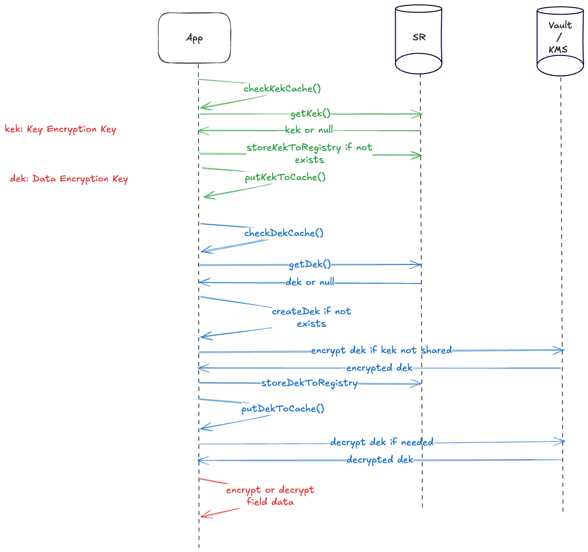

# Test for CSFLE

This project is an example of CSFLE usage.

# Requirements

All the tests have been made using Confluent Cloud and Azure Key Vault.

You need to have a topic named `customers` by default.
Then you need to add a data contract to the topic and an encryption rule.

You need API Keys on Confluent Cloud to access the topic and schemas.

On Azure, you need to create an App Registration and a Key Vault.
You need to create a key in the Key Vault and give the App Registration the right to use it.

Then configure these scripts and configuration files:

1. [credentials.sh](script/credentials.sh) (Use the template [credentials.sh.template](script/credentials-template.sh))
2. [producer-client.properties](src/main/resources/producer-client.properties) (Use the template [producer-client-template.properties](src/main/resources/producer-client-template.properties))
3. [consumer-client.properties](src/main/resources/consumer-client.properties) (Use the template [consumer-client-template.properties](src/main/resources/consumer-client-template.properties))

For the consumer application, you may enable or disable the decryption of the data.
The rules must be commented out or not accordingly in the configuration file.

# Build

This project is a maven project.
In order to build the project, you need to run the following command:

```shell
mvn clean package
```

The needed dependencies for CSFLE are:

```xml
        <dependency>
            <groupId>io.confluent</groupId>
            <artifactId>kafka-schema-registry-client-encryption-azure</artifactId>
            <version>${confluent.version}</version>
        </dependency>
```

# Run

To main runnable classes can be used:

1. [CSFLEAzureAvroProducer.java](src/main/java/io/confluent/demo/csfle/CSFLEAzureAvroProducer.java)
2. [CSFLEAzureAvroConsumer.java](src/main/java/io/confluent/demo/csfle/CSLFEAzureAvroConsumer.java)

# Sequence Diagram

The following sequence diagram shows the flow of a client application encryption / decryption process.
It is not fully accurate but gives a good idea of the process.


